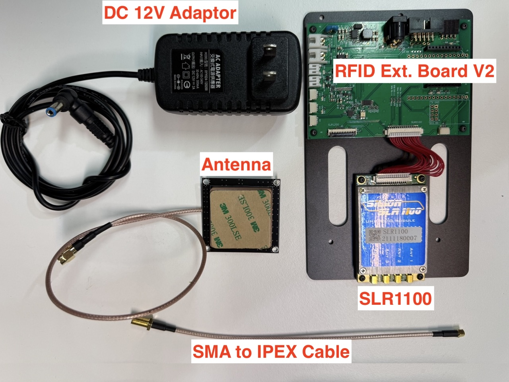
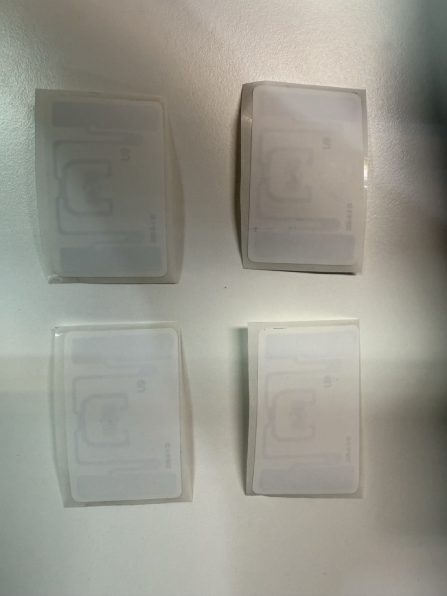
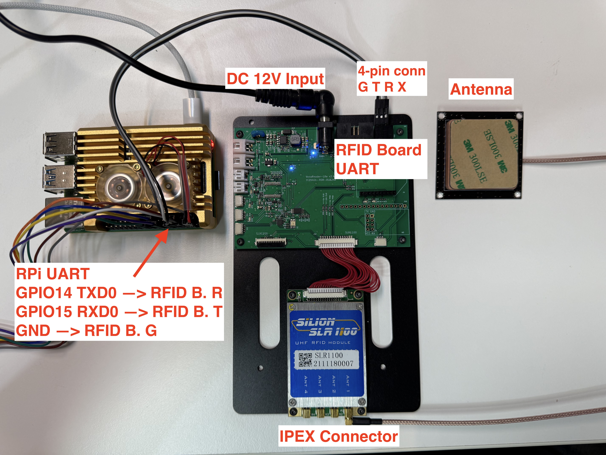
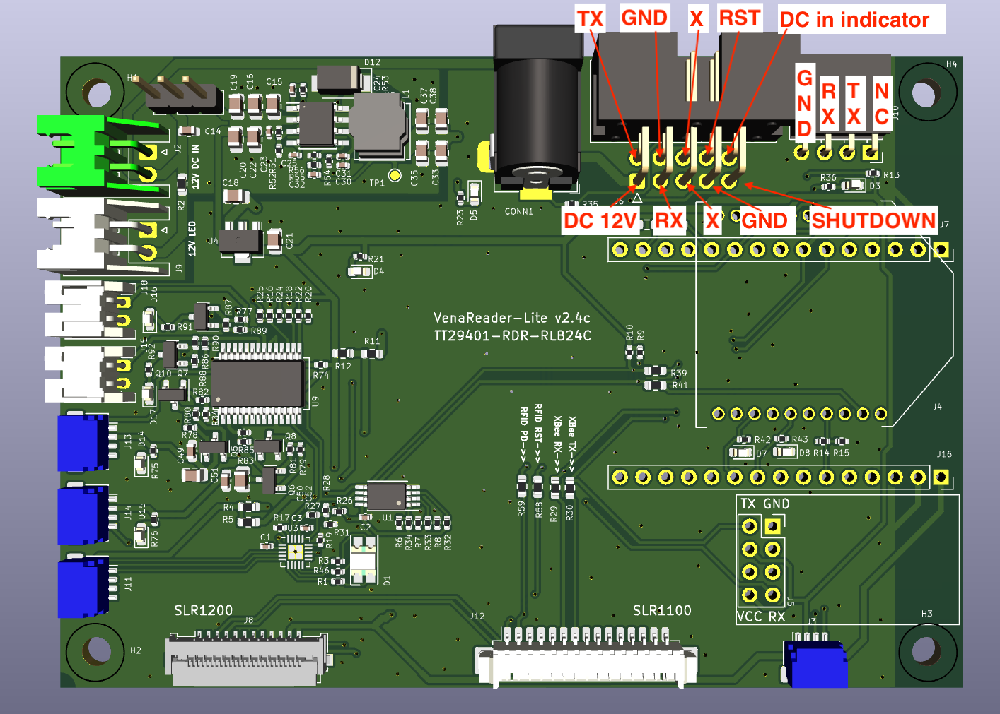
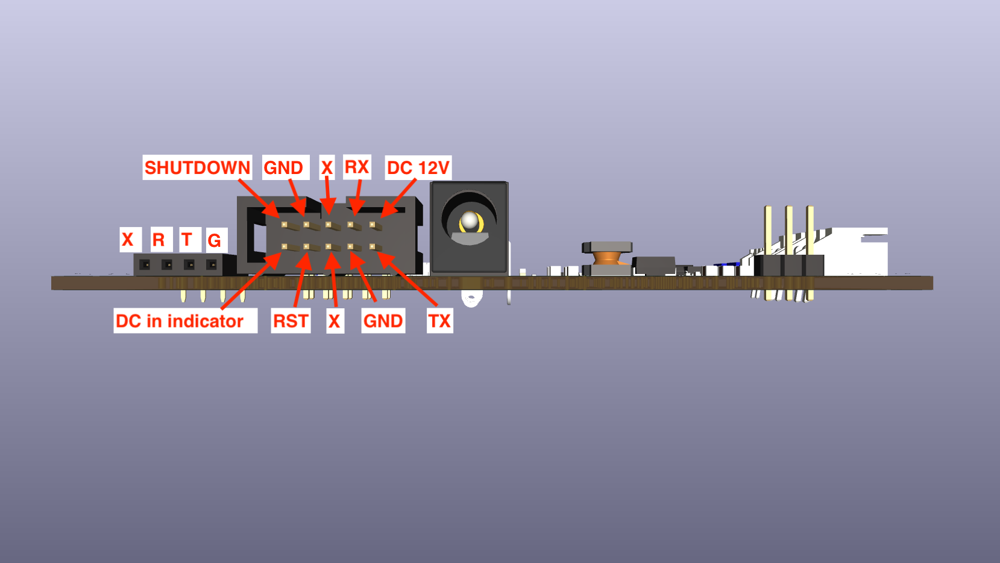
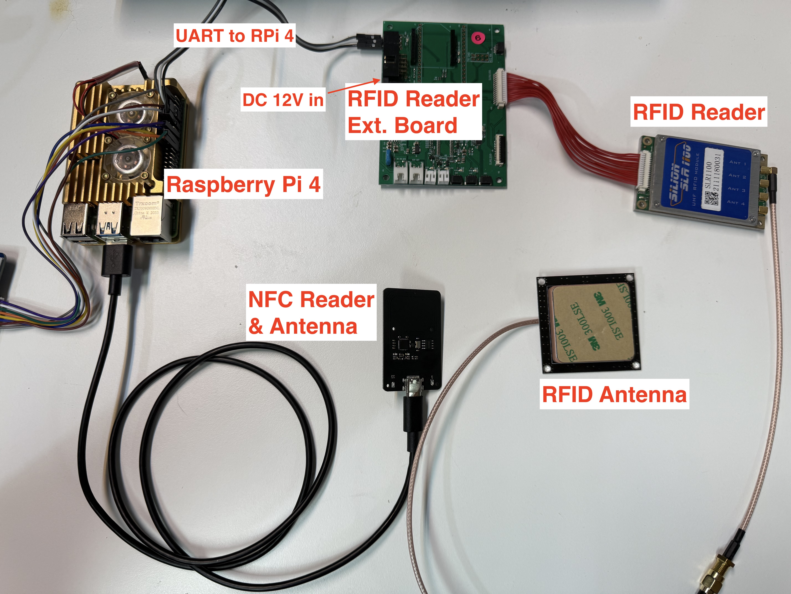

# **RFID / NFC Inventory Management System**

This project integrates two distinct functionalities into a single, web-based application: an RFID inventory tracking system and an NFC-based library management system. The unified interface allows for seamless management of both RFID-tagged items and NFC-tagged items.

## **Features**

* **Dual-Reader Support**: Connects to both an RFID and an NFC reader simultaneously via separate serial ports.  
* **Unified Web Interface**: A single webpage provides distinct sections for managing the inventory.  
* **Real-Time Updates**: Uses WebSockets to deliver instant updates to all connected clients.  
* **Data Import/Export**: Supports downloading and uploading the entire item list as a CSV file.  
* **Combined Item Registration**: A single form to register or update items with RFID (EPC) and NFC (UID) identifiers.  
* **Interactive Item List**: Click any item in the list to load its details for quick editing. The list is paginated for easy navigation.  
* **Status Management**: Update an item's status to "registered", "for sale", or "sold" with dedicated buttons.  
* **Live Tag Scanning**: See the most recently scanned RFID and NFC tag IDs directly on the page to assist with registration.

## **Hardware Requirements**
Before you begin, ensure you have the following hardware:

  * An RFID reader module (e.g., model SLR1100 with antenna)

  * UHF RFID tags for your items

  * Raspberry Pi 4
  * microSD card (32GB)
  * PN532 NFC Reader Module and NFC Tags (e.g., NTAG215)  

### **Hardware Setup**

* Wire the J10 connector to the Raspberry Pi 4 and plugin the DC adaptor as below: 


  
* The pinout of `J10` near by the upper right coner is illustrated as below. 


**J10 Pinout from `left` to `right` :**
  * `p1`: GND
  * `p2`: SLR1100 `UART Rx` (will connect to Raspberry Pi `GPIO14 TXD0`)
  * `p3`: SLR1100 `UART Tx` (will connect to Raspberry Pi `GPIO15 RXD0`)
  * `04`: not in use. 

* [Optional] Here is the pinout of the connector for the 10-pin ribbon cable. This is for those who is confident on building a customized ribbon cable which has DC 12V, UART port, and the other GPIO control.



* Connect `PN532 NFC Reader` to the USB port of the Raspberry Pi 4 USB port. 
Thus, all of the components are connected as below:  




## **Software Setup**

1. **Install Raspberry Pi Imager**: Download and install the [Raspberry Pi Imager](https://www.raspberrypi.com/software/) on your computer.  
2. **Flash the OS Image**: Use the imager to flash **Raspberry Pi OS (64-bit)** onto your microSD card. Before writing, configure the OS to:  
   * Set a hostname (e.g., `rfid-nfc-inventory.local` ).  
   * Configure your Wi-Fi SSID and password.  
3. **Boot the Pi**: Insert the microSD card and power on the Raspberry Pi.  
4. **Login to the Pi**: Connect to your Raspberry Pi via SSH using the hostname you configured.  

```bash
ssh pi@rfid-nfc-inventory.local
```

5. **Enable the Serial Port Hardware:**  
   * Open the Raspberry Pi Configuration tool:  
     sudo raspi-config

   * Navigate to **3 Interface Options** \-\> **I6 Serial Port**.  
   * When asked "Would you like a login shell to be accessible over serial?", select **No**.  
   * When asked "Would you like the serial port hardware to be enabled?", select **Yes**.  
   * Select **Finish** and reboot when prompted.

### **Setup the software on Raspberry Pi 4**

First, clone the code with the following command:

```bash
git clone https://github.com/clementyu/rfid-nfc-inventory.git
```

After cloning, navigate to the project directory:

```bash
cd rfid-nfc-inventory
```

Next, install **nvm (Node Version Manager)** to manage your Node.js versions.

```bash
curl -o- https://raw.githubusercontent.com/nvm-sh/nvm/v0.39.7/install.sh | bash
```

After installation, logout and login again to reload your terminal, or reload your terminal's environment variables by sourcing your profile.

```bash
source \~/.bashrc
```

Then install NodeJS

```bash
nvm install 22  
nvm use 22
```

Finally, install the required npm packages:

```bash
npm install
```

## **Running the Application**

To start the application, run the index.js file, specifying the correct serial ports for your RFID and NFC readers. You can find the port names by running ls /dev/tty\* on your Raspberry Pi. The RFID reader will likely be /dev/ttyUSB1, and the USB-connected NFC reader will be /dev/ttyUSB0 or similar.

```bash
node index.js --rfid-port /dev/ttyUSB0 --nfc-port /dev/ttyUSB1
```

If you are using an RFID Reader Kit from https://github.com/clementyu/rfid-inventory , the `--rfid-port` will be  `/dev/ttyS0` so the command will be

```bash
node index.js --rfid-port /dev/ttyS0 --nfc-port /dev/ttyUSB0
```

The web interface will be available at `http://rfid-nfc-inventory.local:8080` .

## **Using the Web Interface**

Once the server is running, you can access the web interface. The interface is divided into two main sections:

### **Register Items**

This panel is for adding new items to your inventory or editing existing ones.

* **Registering a New Item:**  
  1. Fill in the Item ID, Item Name, Description, and other fields.  
  2. To associate an RFID or NFC tag, you can either:  
     * Click **Read RFID Tag**. The next RFID tag scanned will populate the Container EPC (RFID) field.  
     * Scan an NFC tag with the NFC reader. The Item UID (NFC) field will be populated.  
     * Manually type in the EPC or UID.  
  3. Click **Register/Update Item**. The new item will be saved with a status of registered.  
* **Editing an Existing Item:**  
  1. In the Item List below, simply click on the row of the item you wish to edit.  
  2. The item's details will automatically load into the Register Items form.  
  3. Make your changes and click **Register/Update Item** to save.  
* **Updating Status:**  
  1. First, load an item into the form by clicking it in the list.  
  2. Click **For Sale** to change its status to "for sale".  
  3. Click **Sold** to change its status to "sold".  
* **Live Scan Display:**  
  * The panel below the buttons will show the most recently scanned EPC and UID, along with a timestamp, helping you associate the correct tags with your items.

### **Item List**

This section displays your entire inventory in a searchable and paginated table.

* **Viewing Items:** The table shows all details for each item. Click any row to load it for editing.  
* **Pagination:** Use the dropdown to select how many rows to display per page (10, 30, 50, or 100\) and navigate through pages using the "Previous" and "Next" buttons.  
* **Import/Export:**  
  * Click **Import Inventory** to upload a new itemList.csv file. This will overwrite the current list.  
  * Click **Export Inventory** to download the current item list as a itemList.csv file.


